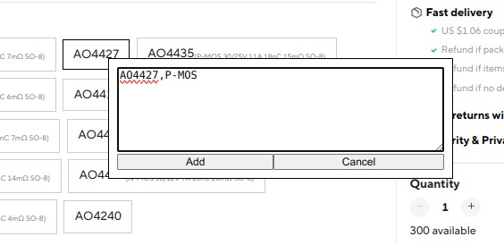

# Chrome SKU hints addon

An addon that adds small hints using an internal database of names.

It's super handy for browsing sites like AliExpress for interesting chips.
Most of the time, there’s no info other than the chip’s name,
so this addon lets you look it up once and shows the details right next to the part name.

<table>
    <tr>
        <th>Original</th>
        <th>Replaced</th>
    </tr>
    <tr>
        <td>
            <a href=".docs/original1.jpg"></a>
        </td>
        <td>
            <a href=".docs/replaced1.jpg"></a>      
        </td>
    </tr>
</table>

### Installation

```shell
npm install
npm run build
```

Install in the browser: `Extension` tab -> enable `Developer mode` -> `Load Unpacked` -> select `dist/` folder.

### Usage

Adding the hint

<a href=".docs/adding1.jpg"></a>
<a href=".docs/adding2.jpg"></a>

### Example configuration

<a href=".docs/config1.jpg"></a>
